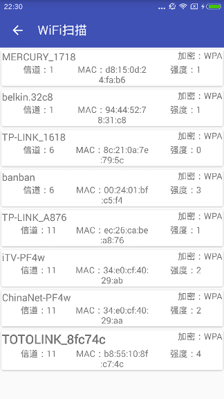

# WiFiDetective

## 功能和实现
1 WiFi扫描：获取你的android设备能够扫描到的所有的WiFi设备，并返回基本信息：SSID、WiFi信号强度、信道以及加密方式  
2 设备扫描：尽可能的获取所有你android设备所在的WiFi下的所有连接该WiFi的设备及其信心：IPMAC、名称或者厂商

## 实现原理 
### WiFi扫描
注册android的广播，实现监听即可。
### 设备扫描
**关键技术**  
1. android下如何进行ping操作  
2. android下如何判断端口是否打开  
3. android如何读取arp表  
4. android下如何通过ip获取mac地址  
5. android下如何通过ip获取部分设备的名称（NetBios service)    
6. android下如何通过mac地址获取设备的厂商  设备的Mac地址都是官方有国际官方组织的，通过这个你可以查到不同设备mac地址段，从而可以得到不同的 厂商信息。       
以上的这些你通过阅读代码就可以得到。请关注……谢谢……     

**业界常用的基本端口信息如下所示：**  
1. 22 linux ssh端口  
2. 80和8081 http 端口  
3. 135 远程打开对方的telnet服务器  
4. 137 在局域网中提供计算机的名字或OP地址查询服务，一般安装了NetBIOS协议后，就会自动开放  
5. 139 Windows获得NetBIOS/SMB服务  
6. 445 局域网中文件的共享端口  
7. 3389 远程桌面服务端口  
8. 5555 Android adb 默认连接端口  
9. 62078 Apple的一个端口

##效果图

   
  

##Thanks
* 进度条来自代码家  (暂时没有实际作用，只是界面）      
https://github.com/daimajia/NumberProgressBar
* android设备实现沉浸式菜单   来自鸿洋  
https://github.com/hongyangAndroid/ColorfulStatusBar
